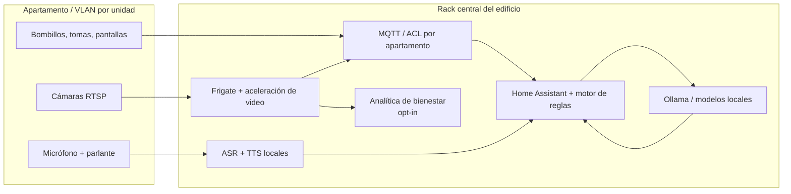

# Arquitectura de IA local y privada

## Objetivo de despliegue

Procesar automatizaciones, voz, video y señales de bienestar dentro del edificio. El rack sólo necesita una salida de Internet temporal y controlada para actualizaciones aprobadas; en operación normal, los flujos de inferencia no salen a Internet.

## Componentes recomendados

| Capa | Tecnología | Rol en el MVP | Regla de privacidad |
| --- | --- | --- | --- |
| Orquestación | Home Assistant + Assist | Integra Matter/Zigbee/KNX/MQTT, escenas, permisos y automatizaciones. | Preferir una instancia/contenedor por apartamento; una instancia compartida sólo con aislamiento de tenant probado. |
| Mensajería | Eclipse Mosquitto | Bus de eventos de dispositivos, Frigate y reglas. | TLS interno, certificado por dispositivo y ACL que impidan publicar o leer tópicos de otro apartamento. |
| Video | Frigate | NVR local, detección/tracking de objetos y eventos hacia MQTT. | RTSP sólo en VLAN de cámaras; sin acceso WAN; zonas de exclusión y retención mínima. |
| Aceleración | GPU NVIDIA, Intel OpenVINO o Coral/Hailo según prueba de carga | Decodificación y detección de video sin cargar la CPU. | No cambia la política de datos: acelera inferencia local. |
| LLM | Ollama en modo local + Qwen3 cuantizado | Personalidad, resúmenes y lenguaje natural; expone una API interna. | Firewall de salida denegado, memoria separada por apartamento y sólo modelos aprobados/cargados en disco. |
| STT | Whisper local mediante `wyoming-whisper` o `whisper.cpp` | Transcripción abierta en español. | El audio se procesa en memoria; no se manda a APIs externas. |
| TTS | Piper/Wyoming | Respuesta hablada local. | Validar licencia del motor y de cada voz antes de uso comercial; la variante mantenida de Piper es GPL-3.0. |
| Wake word | Pulsar-para-hablar en MVP; luego microWakeWord o modelo propio validado | Reduce activaciones accidentales y la captura continua. | No desplegar una palabra de activación sin pruebas específicas para español colombiano ni modelos con licencia no comercial. |
| Analítica | MediaPipe Face/Pose + clasificador temporal propio; YAMNet/fine-tuning para eventos acústicos | Genera indicadores de tos, fatiga o asimetría de marcha bajo consentimiento. | Sin reconocimiento facial ni identificación; sólo eventos agregados y configurables. |

## Flujo de voz sugerido

1. Un satélite de voz envía audio por red privada al servicio Wyoming local.
2. Whisper transcribe la orden; Home Assistant resuelve órdenes deterministas (por ejemplo, "apaga la sala").
3. Sólo consultas abiertas pasan al LLM local mediante una API interna con herramientas permitidas.
4. Un **motor de políticas** valida apartamento, permisos, horario y dispositivo antes de que Home Assistant ejecute una acción.
5. Piper sintetiza la respuesta. La personalidad vive en una plantilla local, versionada y revisable, no en prompts que puedan ejecutar acciones directamente.

Para control de hogar, mantén una ruta rápida determinista y no uses LLM para acciones críticas. Para conversación, limita las herramientas del LLM a lecturas y acciones explícitamente autorizadas.

## Señales de bienestar: diseño seguro

Estas funciones son de alto riesgo: una predicción puede ser errónea y los datos de salud/biométricos requieren una protección reforzada. El MVP debe llamarlas **señales de bienestar** y no emitir diagnósticos.

- **Tos:** usar un clasificador de eventos de audio como base, calibrarlo con muestras autorizadas de los espacios reales y exigir una ventana temporal y umbral antes de generar un evento. No guardar el audio bruto por defecto.
- **Fatiga:** usar landmarks faciales para calcular señales como ojos cerrados prolongadamente, tasa de parpadeo y bostezos. No identificar personas ni usar el resultado para vigilar empleados, arrendatarios o visitantes.
- **Marcha/cojera:** usar pose landmarks en secuencias temporales y comparar simetría/variación contra la propia línea base del titular, no contra una población general. Debe existir revisión humana y opción de desactivar.
- **Respuesta:** mostrar una sugerencia privada y discreta al titular; nunca alertar a administración, aseguradoras o terceros sin una autorización separada y verificable.

## Segmentación y operación del rack

1. Separar VLANs: administración, servidores, IoT por apartamento, cámaras por apartamento y red de invitados. Ninguna cámara ni dispositivo IoT debe poder alcanzar Internet directamente.
2. Usar un firewall interno con política *deny by default*. Sólo el proxy/API de la plataforma accede a servicios internos; el LLM nunca tiene acceso a WAN.
3. Ejecutar servicios en contenedores con almacenamiento cifrado, secretos fuera del repositorio, actualizaciones firmadas y un registro de auditoría inmutable.
4. Mantener video/audio bruto fuera de PostgreSQL. Guardar en el NVR cifrado con una política de retención por cámara; en la base relacional sólo quedan referencias, hashes y metadatos mínimos si el usuario lo autorizó.
5. Medir capacidad por pilotos: cámaras, resolución, FPS, retención, concurrencia de voz y tamaño del modelo. Para un edificio de 50 apartamentos, empieza con un rack redundante (UPS, RAID/ZFS, dos switches y, si la disponibilidad lo exige, nodo de respaldo) y dimensiona GPU tras una prueba de carga real.

## Consentimiento, cumplimiento y producto

- El consentimiento para video, micrófono y cada indicador de bienestar debe ser granular, explícito, revocable y auditable por apartamento/titular/finalidad.
- Ofrece un interruptor físico o visible para micrófono/cámara, señalización en zonas comunes y un modo sin analítica de bienestar.
- Prohíbe cámaras y micrófonos de bienestar en baños, vestidores y otras zonas íntimas por diseño, no sólo por configuración.
- Un evento de tos, fatiga o marcha no debe disparar emergencias, tratamientos, penalizaciones ni publicidad; incluye siempre contexto de incertidumbre y contacto humano.
- En Colombia, salud y biometría se consideran datos sensibles. Valida la política final, contratos de encargado/responsable y la evaluación jurídica con asesoría especializada antes de vender el módulo.

## Fases de implementación

1. **MVP comercial:** calculadora, catálogo, Home Assistant, MQTT y automatizaciones sin cámara/micrófono centralizados.
2. **Piloto privado:** voz local por apartamento con consentimiento, Whisper/Piper y LLM local de herramientas limitadas.
3. **Piloto de visión:** Frigate para seguridad/automatización; métricas de retención y falsos positivos.
4. **Bienestar opt-in:** evaluación ética, validación técnica local, umbrales personalizados y revisión humana antes de ofrecer señales a clientes.

## Referencias técnicas y normativas

- [Home Assistant: asistente de voz completamente local](https://www.home-assistant.io/voice_control/voice_remote_local_assistant/)
- [Frigate: NVR local con detección de objetos](https://docs.frigate.video/)
- [Frigate: detectores y aceleración de hardware](https://docs.frigate.video/configuration/object_detectors/)
- [Ollama: modo local-only](https://docs.ollama.com/faq)
- [MediaPipe Pose Landmarker](https://ai.google.dev/edge/api/mediapipe/python/mp/tasks/vision/PoseLandmarker)
- [TensorFlow: clasificación de eventos de sonido con YAMNet](https://www.tensorflow.org/hub/tutorials/yamnet)
- [Ley 1581 de 2012 (Colombia)](https://www1.funcionpublica.gov.co/eva/gestornormativo/norma.php?i=49981)
