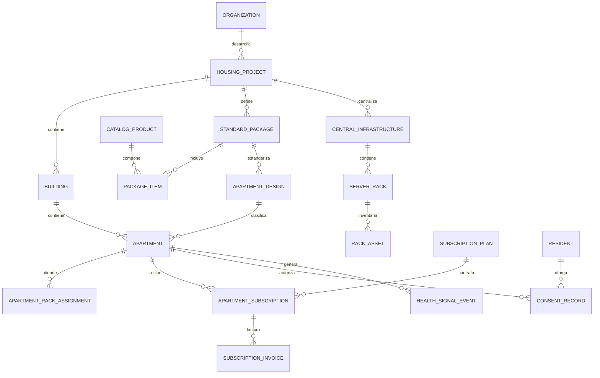

# Modelo relacional B2B

El modelo está en [`prisma/schema.prisma`](../prisma/schema.prisma) y está pensado para PostgreSQL. Separa la configuración comercial de cada apartamento, la infraestructura común de sótano y el ciclo de soporte mensual.



## Reglas de negocio principales

### Paquete estándar

1. `CatalogProduct` es el catálogo comercial (bombillo, cámara, zona de audio, servidor, etc.) y guarda el precio base y los puntos de instalación.
2. `StandardPackage` representa una versión concreta del paquete, por ejemplo **Apartamento 3H / 2B v1**.
3. `PackageItem` conserva un *snapshot* de precio y puntos en el momento de armar el paquete. Así, cambios futuros del catálogo no alteran cotizaciones ya aprobadas.
4. `ApartmentDesign` asigna un paquete estándar a una tipología. Cada `Apartment` hereda dicho paquete; `packageOverrideId` permite una excepción controlada para un apartamento premium.

### Rack centralizado

- `CentralInfrastructure` modela el servicio de IA privado del bloque: capacidad prevista de apartamentos, cámaras y perfil de GPU.
- `ServerRack` representa cada gabinete físico del sótano.
- `RackAsset` inventaría servidores GPU, NVR, switch, firewall, UPS, NAS y PDU. `configuration` puede almacenar capacidades no sensibles (RAM, VRAM, puertos o RAID), **nunca secretos**.
- `ApartmentRackAssignment` deja trazabilidad de qué infraestructura atendió a cada unidad y permite migraciones/alta disponibilidad sin perder historial.

### Suscripción mensual por apartamento

- `SubscriptionPlan` define el plan comercial del integrador (precio mensual y minutos de soporte incluidos).
- `ApartmentSubscription` guarda el precio mensual acordado, fecha de inicio, estado y día de facturación. El precio se copia aquí para no reescribir contratos anteriores.
- `SubscriptionInvoice` registra cada periodo; la restricción única por suscripción/periodo evita facturar dos veces el mismo mes.
- La regla “un solo plan activo por apartamento” se debe validar en el servicio de aplicación o con un índice parcial en una migración SQL de PostgreSQL, porque Prisma no modela índices parciales directamente.

### Privacidad y señales de bienestar

- `Resident` se identifica con un seudónimo; los datos de contacto pueden mantenerse en un sistema de CRM separado con controles de acceso propios.
- `ConsentRecord` versiona el consentimiento por persona, apartamento y finalidad. Una revocación no borra la auditoría, pero debe detener el pipeline y programar la eliminación conforme a la política aplicable.
- `HealthSignalEvent` almacena sólo tipo de evento, confianza, instante y métricas agregadas. No tiene columnas para audio, video, embeddings faciales, imágenes ni clips.
- `DataRetentionPolicy` es una política por proyecto. Los valores por defecto de retención de audio/video crudo son cero; si se habilitan clips, éstos van a almacenamiento cifrado externo y no a PostgreSQL.
- `AuditEvent` permite evidenciar accesos, cambios de consentimiento y operaciones relevantes sin copiar datos sensibles.

## Ejemplo: edificio de 50 apartamentos

1. Crear `HousingProject` y un `Building` con 50 registros de `Apartment`.
2. Crear `StandardPackage` **Tipo A 3H/2B v1** y sus `PackageItem` (por ejemplo, 12 bombillos, 8 tomas, 1 pantalla, 2 cámaras y 2 zonas de audio).
3. Crear un `ApartmentDesign` de 3 habitaciones/2 baños que use ese paquete y asignarlo a las 50 unidades.
4. Registrar una `CentralInfrastructure` “Sótano Torre A”, sus racks y activos; crear 50 `ApartmentRackAssignment` activos.
5. Registrar el `SubscriptionPlan` de soporte y una `ApartmentSubscription` por apartamento al momento de la entrega.
6. Sólo tras un consentimiento explícito, habilitar `WELLNESS_SIGNALS`; el servicio de IA verifica un consentimiento vigente antes de crear un evento.

## Migración inicial

```bash
npx prisma generate
npx prisma migrate dev --name init
```

Antes de producción, agrega autenticación/RBAC en el servicio de aplicación, cifrado gestionado de objetos, un índice parcial para suscripciones activas y migraciones de auditoría inmutables según la política de seguridad del proyecto.
